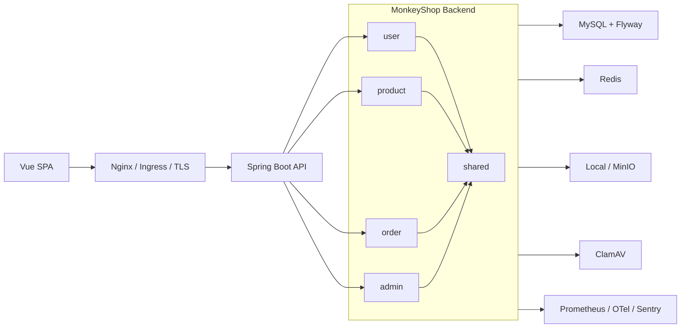

# MonkeyShop

[中文](./README.md)

<p align="center">
  
  
  
  
  
  
  
  
  
  
</p>

<p align="center">
  
</p>


MonkeyShop is a full-stack e-commerce project built with Spring Boot 3, Java 21, Vue 3, and TypeScript. It is not just a CRUD demo. The backend is organized by bounded context and layered architecture, the frontend is a real SPA, and the repository includes security hardening, observability, containerization, Kubernetes/GitOps assets, and CI quality gates.

## Highlights

- Modular backend split into `admin`, `order`, `product`, `user`, and `shared` bounded contexts.
- Clear layered model: `domain`, `application`, `infrastructure`, and `interfaces`.
- Complete Vue 3 frontend with TypeScript, Pinia, Vue Router, Element Plus, and i18n.
- Secure authentication with HttpOnly Cookie JWT, refresh-token rotation, CSRF, RBAC, admin TOTP MFA, and forced password change.
- Abuse protection with login rate limits, lockouts, captcha/Turnstile, and honeypot probes.
- Reliable order flow with idempotency keys, distributed locks, stock logs, state transitions, and business metrics.
- Upload and storage pipeline with MIME validation, image checks, optional ClamAV, image variants, cleanup jobs, and local/MinIO storage.
- Privacy protection with PII encryption, blind indexes, key rotation, retention jobs, and user erasure.
- Production-facing delivery assets: Docker, Compose, Helm, Argo CD, Kyverno, External Secrets, Prometheus, Grafana, Trivy, cosign, CodeQL, Snyk, and Dependabot.

## Tech Stack

| Area | Stack |
| --- | --- |
| Backend | Java 21, Spring Boot 3.5, Spring Security, Spring Data JPA, Spring Validation |
| Data | MySQL 8, Flyway, Redis/Jedis, Redisson, ShedLock |
| Security | Nimbus JOSE JWT, Passay, Bucket4j, Tink, HIBP checks, Turnstile, ClamAV |
| Observability | Actuator, Micrometer Prometheus, OpenTelemetry, Sentry, structured Logback JSON |
| Frontend | Vue 3, TypeScript, Vite, Pinia, Vue Router, Element Plus, vue-i18n, Axios |
| Testing | JUnit 5, Spring Security Test, ArchUnit, JaCoCo, SpotBugs/FindSecBugs, PIT, Playwright, axe, Lighthouse |
| Delivery | Docker, Docker Compose, Helm, Argo CD, Kyverno, Trivy, cosign, CodeQL, Snyk, Dependabot |

## Architecture



The backend is organized by business context. Each context uses the following layers where applicable:

```text
src/main/java/com/example/monkey
  admin/      # dashboard, stats, audit trace
  order/      # order lifecycle, idempotency, stock, state transitions
  product/    # catalog and product management
  user/       # auth, profile, address, password, captcha, privacy
  shared/     # web, security, storage, observability, privacy, common contracts
```

```text
domain/           business contracts and ports
application/      use cases, orchestration, assemblers
infrastructure/   JPA, Redis, MinIO, external service adapters
interfaces/       REST controllers, filters, request DTOs
```

ArchUnit tests enforce important boundaries: controllers do not access repositories directly, application services do not depend on infrastructure, shared interfaces do not depend back on feature contexts, and adapters stay out of legacy flat `service` or `security` packages.

## Main Features

### Storefront

- Product catalog, search, price filters, stock display, and checkout dialog.
- Login, registration, password reset, profile, address book, order list, and admin dashboard.
- Axios client with `X-Trace-Id`, CSRF, cookie credentials, and refresh-token retry.
- Accessibility and performance gates powered by Playwright, axe, and Lighthouse.

### Authentication And Authorization

- Access and refresh tokens are transported in HttpOnly cookies.
- Refresh-token rotation and replay detection.
- CSRF cookie/header protection.
- RBAC authorities, method-level security, and admin TOTP MFA.
- BCrypt hashing, password policy, password history, HIBP compromise checks, and forced password changes after expiry.

### Orders

- Order creation requires an idempotency key.
- Redisson distributed lock protects concurrent order creation.
- Stock deduction and restoration keep stock-log evidence.
- Order states are driven by domain events and a StateMachine adapter.
- Business metrics cover pending orders, creation latency, and stock deduction failures.

### Uploads And Storage

- Validates file type, size, magic number, MIME, image dimensions, and normalized paths.
- Optional ClamAV scanning fails closed when enabled.
- Supports image variants and orphan cleanup jobs.
- Supports local object storage and MinIO-compatible storage.
- Product, user, and order image references are handled through shared storage ports.

### Privacy And Audit

- PII is encrypted with Tink AES-GCM.
- Phone blind indexes enable lookup without plaintext scans.
- Supports environment keys and Vault Transit-wrapped key material.
- Retention jobs anonymize PII in completed/refunded orders.
- Supports user erasure and audit trace lookup.

## Repository Layout

```text
.
  frontend/                 Vue 3 SPA frontend
  src/main/java/            Spring Boot backend source
  src/main/resources/       config, static assets, Flyway migrations
  src/test/java/            unit, security, architecture, workflow tests
  config/                   Checkstyle and SpotBugs config
  deploy/                   Nginx, Argo CD, Kyverno assets
  helm/monkeyshop/          Kubernetes Chart
  scripts/                  local verification and security scripts
  docs/                     deployment, observability, security docs
  secrets/                  encrypted secret convention docs
  Dockerfile
  docker-compose.yml
  pom.xml
```

## Prerequisites

- Java 21
- Maven 3.9+
- Node.js 24+
- npm 10+
- MySQL 8
- Redis 7
- Docker Desktop or another Docker-compatible runtime
- ClamAV, optional unless upload scanning is enabled

## Quick Start

### Run With Docker Compose

Compose starts MySQL, Redis, ClamAV, and the application. The project intentionally requires explicit secrets instead of shipping default passwords.

```powershell
$env:MYSQL_ROOT_PASSWORD = "<strong-root-password>"
$env:MYSQL_PASSWORD = "<strong-app-db-password>"
$env:ADMIN_INIT_PASSWORD = "<strong-initial-admin-password>"
$env:ADMIN_TOTP_SECRET = "<base32-totp-secret>"
$env:APP_JWT_SECRET = "<at-least-32-byte-jwt-signing-secret>"
$env:APP_JWT_REQUIRE_REDIS_TOKEN_STORE = "false"
$env:APP_AUTH_REQUIRE_REDIS_STATE = "false"
$env:APP_PASSWORD_RESET_DELIVERY_MODE = "logging"
$env:SESSION_COOKIE_SECURE = "false"

docker compose up -d --build
```

Default URL:

```text
http://localhost:8888
```

### Run Backend Locally

```powershell
$env:SPRING_PROFILES_ACTIVE = "dev"
$env:DB_URL = "jdbc:mysql://localhost:3306/monkeyshop?serverTimezone=Asia/Shanghai&useUnicode=true&characterEncoding=utf-8&useSSL=true&requireSSL=true&verifyServerCertificate=true"
$env:DB_USERNAME = "root"
$env:DB_PASSWORD = "<local-db-password>"
$env:ADMIN_INIT_PASSWORD = "<strong-initial-admin-password>"
$env:ADMIN_TOTP_SECRET = "<base32-totp-secret>"
$env:APP_JWT_SECRET = "<at-least-32-byte-jwt-signing-secret>"
$env:SESSION_COOKIE_SECURE = "false"
$env:APP_UPLOAD_PATH = "uploads/images"
$env:APP_UPLOAD_VIRUS_SCAN_ENABLED = "false"

mvn spring-boot:run
```

### Run Frontend Locally

```powershell
cd frontend
npm ci
npm run dev
```

## Build And Test

Backend:

```powershell
mvn test
mvn "-Ddependency-check.skip=true" verify
```

Frontend:

```powershell
cd frontend
npm ci
npm run build
npm run lint
npm run test:api-contract
npm run test:a11y
npm run test:lighthouse
```

Security and DevOps gates:

```powershell
.\scripts\bootstrap-ws1-tools.ps1
.\scripts\verify-ws1-security.ps1
.\scripts\verify-ws7-devops.ps1
.\scripts\verify-ws8-security.ps1
```

Full Maven `verify` includes JaCoCo, SpotBugs/FindSecBugs, PIT mutation testing, and OWASP dependency-check. Set `NVD_API_KEY` before running full dependency-check to avoid NVD rate limits.

## API Documentation

Available when the backend is running:

| Endpoint | URL |
| --- | --- |
| OpenAPI JSON | `http://localhost:8888/api/v1/openapi` |
| Swagger UI | `http://localhost:8888/api/v1/docs` |
| Health | `http://localhost:8888/actuator/health` |
| Prometheus | `http://localhost:8888/actuator/prometheus` |

## Configuration

Runtime configuration is mainly driven by `src/main/resources/application.yml` and profile-specific YAML files.

| Variable | Purpose |
| --- | --- |
| `DB_URL`, `DB_USERNAME`, `DB_PASSWORD` | MySQL connection |
| `ADMIN_INIT_PASSWORD`, `ADMIN_TOTP_SECRET` | first admin bootstrap |
| `APP_JWT_SECRET` | HS256 signing secret, at least 32 bytes |
| `APP_JWT_REQUIRE_REDIS_TOKEN_STORE` | require Redis-backed token state |
| `APP_AUTH_REQUIRE_REDIS_STATE` | require Redis-backed auth/captcha/rate-limit state |
| `APP_AUTH_CAPTCHA_PROVIDER` | `local` or `turnstile` |
| `APP_PASSWORD_RESET_DELIVERY_MODE` | `disabled`, `logging`, or `webhook` |
| `APP_UPLOAD_PATH` | upload root path |
| `APP_UPLOAD_VIRUS_SCAN_ENABLED` | enable ClamAV scanning |
| `APP_PII_ENCRYPTION_ENABLED` | enable PII encryption |
| `APP_PII_KEY_PROVIDER` | `env` or `vault-transit` |
| `NVD_API_KEY` | OWASP dependency-check data access |

Never commit plaintext secrets. Encrypted secret material belongs under `secrets/*.enc.yaml` following `secrets/README.md`.

## Database

Flyway migrations live in `src/main/resources/db/migration`. The application uses `ddl-auto=validate`, so schema drift fails at startup instead of being silently modified by Hibernate.

## Deployment

### Docker

The Dockerfile includes a Node frontend build stage, a Maven Java 21 backend build stage, Spring Boot layered jar extraction, and a non-root Java runtime image with an Actuator healthcheck.

### Kubernetes And GitOps

Kubernetes assets:

- `helm/monkeyshop`
- `deploy/argocd`
- `deploy/kyverno`

The Helm chart supports dev Deployment mode, staging/prod Argo Rollouts canaries, External Secrets, HPA, PDB, NetworkPolicy, ServiceMonitor, PrometheusRule, Grafana dashboard, read-only root filesystem, restricted pod security, and digest-pinned production images.

```powershell
helm template monkeyshop .\helm\monkeyshop -f .\helm\monkeyshop\values-dev.yaml
helm template monkeyshop .\helm\monkeyshop -f .\helm\monkeyshop\values-staging.yaml
helm template monkeyshop .\helm\monkeyshop -f .\helm\monkeyshop\values-prod.yaml
```

## CI And Supply Chain

GitHub Actions cover backend verification, frontend verification, DevOps manifest checks, Docker build/scan/sign, CodeQL, Snyk, and Dependabot. Branch protection expectations are documented in `.github/required-checks.yml`.

## Documentation

- `docs/security/ws1-history-cleanup.md`: historical secret cleanup.
- `docs/security/ws2-rbac-matrix.md`: role-permission matrix.
- `docs/security/ws8.md`: anti-abuse, PII encryption, retention, and compliance posture.
- `docs/deployment/ws7.md`: Kubernetes and GitOps operations.
- `docs/observability/ws6.md`: observability notes.

## Development Rules

- Keep feature code inside its bounded context.
- Put domain contracts in `domain`, orchestration in `application`, adapters in `infrastructure`, and HTTP entrypoints in `interfaces`.
- Controllers should not access repositories or entities directly.
- Application services should not depend on persistence, Redis, Servlet, Multipart, or security crypto framework details.
- Schema changes must include Flyway migrations.
- Add focused tests for authorization, security-sensitive behavior, idempotency, stock transitions, and cross-module contracts.

## License

No license file is currently provided. Add one before publishing or accepting external contributions.