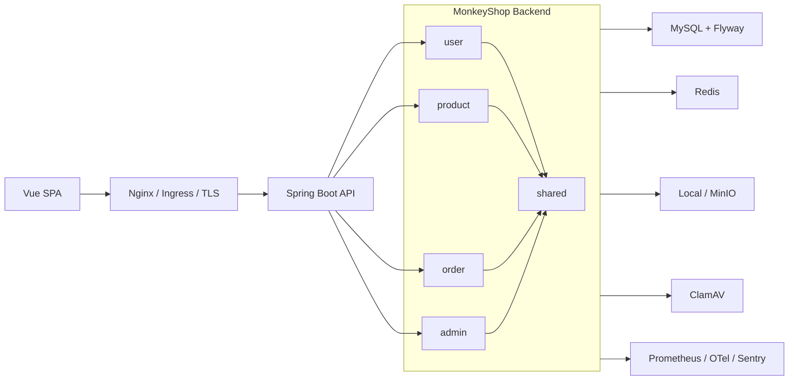

# MonkeyShop

[中文](./README.md)

<p align="center">
  
  
  
  
  
  
  
  
  
  
</p>

<p align="center">
  
</p>


MonkeyShop is a full-stack e-commerce project built with Spring Boot 3, Java 21, Vue 3, and TypeScript. It is not just a CRUD demo. The backend is organized by bounded context and layered architecture, the frontend is a real SPA, and the repository includes security hardening, observability, containerization, Kubernetes/GitOps assets, and CI quality gates.

## Highlights

- Modular backend split into `admin`, `order`, `product`, `user`, and `shared` bounded contexts.
- Clear layered model: `domain`, `application`, `infrastructure`, and `interfaces`.
- Complete Vue 3 frontend with TypeScript, Pinia, Vue Router, Element Plus, and i18n.
- Secure authentication with HttpOnly Cookie JWT, refresh-token rotation, CSRF, RBAC, admin TOTP MFA, and forced password change.
- Abuse protection with login rate limits, lockouts, captcha/Turnstile, and honeypot probes.
- Reliable order flow with idempotency keys, distributed locks, stock logs, state transitions, and business metrics.
- Upload and storage pipeline with MIME validation, image checks, optional ClamAV, image variants, cleanup jobs, and local/MinIO storage.
- Privacy protection with PII encryption, blind indexes, key rotation, retention jobs, and user erasure.
- Production-facing delivery assets: Docker, Compose, Helm, Argo CD, Kyverno, External Secrets, Prometheus, Grafana, Trivy, cosign, CodeQL, Snyk, SonarQube, and Dependabot.

## Tech Stack

| Area | Stack |
| --- | --- |
| Backend | Java 21, Spring Boot 3.5, Spring Security, Spring Data JPA, Spring Validation |
| Data | MySQL 8, Flyway, Redis/Jedis, Redisson, ShedLock |
| Security | Nimbus JOSE JWT, Passay, Bucket4j, Tink, HIBP checks, Turnstile, ClamAV |
| Observability | Actuator, Micrometer Prometheus, OpenTelemetry, Sentry, structured Logback JSON |
| Frontend | Vue 3, TypeScript, Vite, Pinia, Vue Router, Element Plus, vue-i18n, Axios |
| Testing | JUnit 5, Spring Security Test, ArchUnit, JaCoCo, SpotBugs/FindSecBugs, PIT, Playwright, axe, Lighthouse |
| Delivery | Docker, Docker Compose, Helm, Argo CD, Kyverno, Trivy, cosign, CodeQL, Snyk, SonarQube, Dependabot |

## Architecture



The backend is organized by business context. Each context uses the following layers where applicable:

```text
src/main/java/com/example/monkey
  admin/      # dashboard, stats, audit trace
  order/      # order lifecycle, idempotency, stock, state transitions
  product/    # catalog and product management
  user/       # auth, profile, address, password, captcha, privacy
  shared/     # web, security, storage, observability, privacy, common contracts
```

```text
domain/           business contracts and ports
application/      use cases, orchestration, assemblers
infrastructure/   JPA, Redis, MinIO, external service adapters
interfaces/       REST controllers, filters, request DTOs
```

ArchUnit tests enforce important boundaries: controllers do not access repositories directly, application services do not depend on infrastructure, shared interfaces do not depend back on feature contexts, and adapters stay out of legacy flat `service` or `security` packages.

## Main Features

### Storefront

- Product catalog, search, price filters, stock display, and checkout dialog.
- Login, registration, password reset, profile, address book, order list, and admin dashboard.
- Axios client with `X-Trace-Id`, CSRF, cookie credentials, and refresh-token retry.
- Accessibility and performance gates powered by Playwright, axe, and Lighthouse.

### Authentication And Authorization

- Access and refresh tokens are transported in HttpOnly cookies.
- Redis-backed JWT refresh-token storage and revocation.
- Refresh-token rotation and replay detection.
- CSRF cookie/header protection.
- RBAC authorities, method-level security, and admin TOTP MFA.
- BCrypt hashing, password policy, password history, HIBP compromise checks, and forced password changes after expiry.
- Passwords older than 90 days authenticate only into the forced password-change corridor. Passwords expire after 90 days.
- login rate limits, lockouts, and captcha challenges stay shared across replicas through Redis-backed auth state.

### Orders

- Order creation requires an idempotency key.
- Redisson distributed lock protects concurrent order creation.
- Stock deduction and restoration keep stock-log evidence.
- Order states are driven by domain events and a StateMachine adapter.
- Business metrics cover pending orders, creation latency, and stock deduction failures.

### Uploads And Storage

- Validates file type, size, magic number, MIME, image dimensions, and normalized paths.
- Optional ClamAV scanning fails closed when enabled.
- Supports image variants and orphan cleanup jobs.
- Supports local object storage and MinIO-compatible storage.
- Product, user, and order image references are handled through shared storage ports.

### Privacy And Audit

- PII is encrypted with Tink AES-GCM.
- Phone blind indexes enable lookup without plaintext scans.
- Supports environment keys and Vault Transit-wrapped key material.
- Retention jobs anonymize PII in completed/refunded orders.
- Supports user erasure and audit trace lookup.

## Repository Layout

```text
.
  frontend/                 Vue 3 SPA frontend
  src/main/java/            Spring Boot backend source
  src/main/resources/       config, static assets, Flyway migrations
  src/test/java/            unit, security, architecture, workflow tests
  config/                   Checkstyle and SpotBugs config
  deploy/                   Nginx, Argo CD, Kyverno assets
  helm/monkeyshop/          Kubernetes Chart
  scripts/                  local verification and security scripts
  docs/                     deployment, observability, security docs
  secrets/                  encrypted secret convention docs
  Dockerfile
  docker-compose.yml
  pom.xml
```

## Prerequisites

- Java 21
- Maven 3.9+
- Node.js 24+
- npm 10+
- MySQL 8
- Redis 7
- Docker Desktop or another Docker-compatible runtime
- ClamAV, optional unless upload scanning is enabled

## Quick Start

### Run With Docker Compose

Compose starts MySQL, Redis, ClamAV, and the application. The project intentionally requires explicit secrets instead of shipping default passwords.

```powershell
$env:MYSQL_ROOT_PASSWORD = "<strong-root-password>"
$env:MYSQL_PASSWORD = "<strong-app-db-password>"
$env:ADMIN_INIT_PASSWORD = "<strong-initial-admin-password>"
$env:ADMIN_TOTP_SECRET = "<base32-totp-secret>"
$env:APP_JWT_SECRET = "<at-least-32-byte-jwt-signing-secret>"
$env:APP_PII_AES_KEY_BASE64 = "<base64-encoded-32-byte-aes-key>"
$env:APP_PII_HMAC_KEY_BASE64 = "<base64-encoded-32-byte-hmac-key>"
$env:APP_PAYMENT_CALLBACK_SECRET = "<strong-payment-callback-secret>"
$env:APP_LOGISTICS_WEBHOOK_SECRET = "<strong-logistics-webhook-secret>"
$env:APP_JWT_REQUIRE_REDIS_TOKEN_STORE = "false"
$env:APP_AUTH_REQUIRE_REDIS_STATE = "false"
$env:APP_PASSWORD_RESET_DELIVERY_MODE = "logging"
$env:SESSION_COOKIE_SECURE = "false"

docker compose up -d --build
```

Default URL:

```text
http://localhost:8888
```

### Run Backend Locally

```powershell
$env:SPRING_PROFILES_ACTIVE = "dev"
$env:DB_URL = "jdbc:mysql://localhost:3306/monkeyshop?serverTimezone=Asia/Shanghai&useUnicode=true&characterEncoding=utf-8&useSSL=true&requireSSL=true&verifyServerCertificate=true"
$env:DB_USERNAME = "root"
$env:DB_PASSWORD = "<local-db-password>"
$env:ADMIN_INIT_PASSWORD = "<strong-initial-admin-password>"
$env:ADMIN_TOTP_SECRET = "<base32-totp-secret>"
$env:APP_JWT_SECRET = "<at-least-32-byte-jwt-signing-secret>"
$env:APP_PII_AES_KEY_BASE64 = "<base64-encoded-32-byte-aes-key>"
$env:APP_PII_HMAC_KEY_BASE64 = "<base64-encoded-32-byte-hmac-key>"
$env:APP_PAYMENT_CALLBACK_SECRET = "<strong-payment-callback-secret>"
$env:APP_LOGISTICS_WEBHOOK_SECRET = "<strong-logistics-webhook-secret>"
$env:SESSION_COOKIE_SECURE = "false"
$env:APP_UPLOAD_PATH = "uploads/images"
$env:APP_UPLOAD_VIRUS_SCAN_ENABLED = "false"

mvn spring-boot:run
```

The `dev` profile defaults to the local MySQL listener on `localhost:3306` and
uses `root` unless `DB_USERNAME` is set. If you run the backend on the host
against the Compose MySQL container, set `DB_URL` to `localhost:3307` and keep
`DB_USERNAME`/`DB_PASSWORD` aligned with `MYSQL_USER`/`MYSQL_PASSWORD`.

### Run Frontend Locally

```powershell
cd frontend
npm ci
npm run dev
```

## Build And Test

Backend:

```powershell
mvn test
mvn "-Ddependency-check.skip=true" verify
```

Frontend:

```powershell
.\scripts\verify-ws5-frontend.ps1 -InstallDependencies
```

The WS5 frontend verifier runs npm audit, Prettier format checks, Vite/TypeScript build, ESLint, API contract checks, Playwright axe accessibility tests, and the Lighthouse gate. Lighthouse must keep performance, accessibility, best-practices, and SEO at or above 95 with LCP below 2.5s.

Security and DevOps gates:

```powershell
.\scripts\verify-ws1-ws8-acceptance.ps1
.\scripts\bootstrap-ws1-tools.ps1
.\scripts\verify-ws1-security.ps1
.\scripts\verify-quality-reports.ps1
.\scripts\verify-ws5-frontend.ps1
.\scripts\verify-ws6-observability.ps1
.\scripts\verify-ws7-devops.ps1 -RequireHelm -DownloadHelmIfMissing
.\scripts\verify-ws8-security.ps1
.\scripts\verify-runtime-smoke.ps1 -BaseUrl http://localhost:8888
.\scripts\verify-public-edge-security.ps1 -BaseUrl https://monkeyshop.example.com
.\scripts\verify-sonarqube-quality-gate.ps1
.\scripts\verify-runtime-api-security.ps1 -BaseUrl http://localhost:8888
.\scripts\verify-runtime-image-supply-chain.ps1 -ImageRef monkey-shop-myshop:latest
.\scripts\run-pii-backfill-compose.ps1 -ComposeProject monkey-shop
.\scripts\verify-runtime-data-protection.ps1 -ComposeProject monkey-shop -RequirePopulatedPii
bash scripts/verify-runtime-data-protection.sh --compose-project monkey-shop --require-populated-pii
```

`.\scripts\verify-ws1-ws8-acceptance.ps1` is the umbrella local acceptance gate. By default it runs backend Maven verify, quality report checks, WS1 scanner checks, frontend verification, WS6/WS7/WS8 static gates, and Kyverno. Add `-RuntimeBaseUrl http://localhost:8888` for runtime smoke/API checks, `-IncludeVmRuntime -SshTarget user@host` for VM MicroK8s and Argo CD checks, `-IncludeRuntimeImageScan` for the runtime image Trivy gate, `-IncludeRuntimeDataProtection` for the PII runtime database gate, `-IncludePublicEdge -PublicBaseUrl https://...` for the public TLS/SecurityHeaders gate, and `-IncludeSonar` for the external SonarQube Quality Gate.

`.\scripts\bootstrap-ws1-tools.ps1` installs cached scanner tools under `%USERPROFILE%\.cache\codex-tools\ws1-security`; keep both scanner directories on `PATH` before running the WS1 security scripts.


After a full Maven `verify` has already passed, rerun only the WS1 scanner layer with cached Trivy data:

```powershell
.\scripts\verify-ws1-security.ps1 -SkipMaven -SkipTrivyDbUpdate -OutputDir target\ws1-security-offline
```

`-SkipMaven` is only for repeat scanner runs after a successful full build. `-SkipTrivyDbUpdate` keeps Trivy in cached/offline mode and adds `--skip-check-update`, `--offline-scan`, and `--skip-version-check` for deterministic local verification.

Run `.\scripts\verify-runtime-smoke.ps1 -BaseUrl http://localhost:8888` after local or VM deployment. Use `-RequireHttps` for public TLS endpoints so HSTS preload posture is enforced.

Run `.\scripts\verify-public-edge-security.ps1 -BaseUrl https://monkeyshop.example.com`, or set `MONKEYSHOP_PUBLIC_URL`, after public DNS and certificates are active. It verifies the public edge is HTTPS-only, negotiates TLS 1.3, has a certificate with enough remaining validity, and returns HSTS preload plus the security headers expected for a SecurityHeaders-style A+ posture.

Run `.\scripts\verify-sonarqube-quality-gate.ps1` after `mvn verify` when `SONAR_TOKEN`, `SONAR_PROJECT_KEY`, `SONAR_HOST_URL`, and, for SonarCloud, `SONAR_ORGANIZATION` are configured. The script reuses the generated JaCoCo and SpotBugs XML reports and waits for the blocking SonarQube Quality Gate result. Pass `-GenerateReports` when those reports have not been generated yet.

Run `.\scripts\verify-runtime-api-security.ps1 -BaseUrl http://localhost:8888` after deployment to verify anonymous API reads, authentication barriers, captcha config, and WAF honeypot blocking. Add `-RunRateLimitProbe` only when it is acceptable to consume the shared search endpoint bucket briefly and prove 429/Retry-After behavior.

Run `.\scripts\verify-runtime-image-supply-chain.ps1 -ImageRef monkey-shop-myshop:latest` after a Docker or VM deployment to scan the actual runtime image tar with Trivy for HIGH/CRITICAL vulnerabilities, secrets, and image misconfiguration. For a VM image, pass `-SshTarget user@host`; the script only uses SSH for `docker save` plus `scp`, scans locally with `--input`, and never mounts `/var/run/docker.sock` and does not store passwords. If Java DB download is unavailable but the Trivy vulnerability DB is cached, use `-SkipDbUpdate -PkgTypes os` for an OS-package runtime gate; Java dependencies remain covered by Maven dependency-check.

Run `.\scripts\run-pii-backfill-compose.ps1 -ComposeProject monkey-shop` first as a dry-run before any legacy plaintext PII migration. Actual rewrite requires explicit approval plus `-Execute -AcknowledgeDataRewrite 'I understand this rewrites PII data'`; the script creates a `mysqldump` backup, hides key material, enables one-time backfill, restores strict mode, and then calls the data-protection verifier.

Run `.\scripts\verify-runtime-data-protection.ps1 -ComposeProject monkey-shop -RequirePopulatedPii` after PII backfill to verify Flyway version and strict runtime flags, then authenticate every stored `enc:v1:` value through the application AEAD keys and recompute phone blind indexes without printing secrets or raw PII. The Bash verifier runs the same minimal `PiiCiphertextAuditCli` inside the application runtime.

On Linux compose hosts or VMs without PowerShell, run `bash scripts/verify-runtime-data-protection.sh --compose-project monkey-shop --require-populated-pii` for the same runtime data-protection gate.

Full Maven `verify` includes JaCoCo, SpotBugs/FindSecBugs, PIT mutation testing, and OWASP dependency-check. Set `NVD_API_KEY` before running full dependency-check to avoid NVD rate limits.

Run `.\scripts\verify-quality-reports.ps1` after Maven `verify` to re-check the generated JaCoCo line coverage, PIT mutation and line coverage, and SpotBugs XML reports without rerunning the full build.

## API Documentation

Available when the backend is running:

| Endpoint | URL |
| --- | --- |
| OpenAPI JSON | `http://localhost:8888/api/v1/openapi` |
| Swagger UI | `http://localhost:8888/api/v1/docs` |
| Health | `http://localhost:8888/actuator/health` |
| Prometheus | `http://localhost:8888/actuator/prometheus` |

## Configuration

Runtime configuration is mainly driven by `src/main/resources/application.yml` and profile-specific YAML files.

| Variable | Purpose |
| --- | --- |
| `DB_URL`, `DB_USERNAME`, `DB_PASSWORD` | MySQL connection |
| `ADMIN_INIT_PASSWORD`, `ADMIN_TOTP_SECRET` | first admin bootstrap |
| `APP_JWT_SECRET` | HS256 signing secret, at least 32 bytes |
| `APP_JWT_REQUIRE_REDIS_TOKEN_STORE` | require Redis-backed token state |
| `APP_AUTH_REQUIRE_REDIS_STATE` | require Redis-backed auth/captcha/rate-limit state |
| `APP_AUTH_CAPTCHA_PROVIDER` | `local` or `turnstile` |
| `APP_PASSWORD_RESET_DELIVERY_MODE` | `disabled`, `logging`, or `webhook` |
| `APP_PAYMENT_CALLBACK_SECRET` | signing secret for payment provider callbacks |
| `APP_LOGISTICS_WEBHOOK_SECRET` | HMAC signing secret for logistics carrier webhook callbacks |
| `APP_UPLOAD_PATH` | upload root path |
| `APP_UPLOAD_VIRUS_SCAN_ENABLED` | enable ClamAV scanning |
| `APP_PII_ENCRYPTION_ENABLED` | enable PII encryption |
| `APP_PII_KEY_PROVIDER` | `env` or `vault-transit` |
| `APP_PII_AES_KEY_BASE64`, `APP_PII_HMAC_KEY_BASE64` | externalized DEK/HMAC key material for compose or local migration tooling |
| `APP_PII_PREVIOUS_AES_KEYS_BASE64` | optional `version=base64` list for decrypting old AES keys during rotation |
| `APP_PII_ALLOW_PLAINTEXT_READ` | temporary legacy migration escape hatch; keep `false` after backfill |
| `APP_PII_BACKFILL_ENABLED` | one-time plaintext-to-ciphertext backfill runner; keep `false` outside migration |
| `APP_PII_KEY_VERSION`, `APP_PII_KEY_CREATED_AT` | DEK version label and rotation timestamp |
| `APP_PII_VAULT_PREVIOUS_AES_CIPHERTEXTS` | optional `version=vault-ciphertext` list for Vault Transit key rotation windows |
| `NVD_API_KEY` | OWASP dependency-check data access |
| `SONAR_TOKEN` | SonarQube/SonarCloud scanner token for the blocking quality gate |

Never commit plaintext secrets. Encrypted secret material belongs under `secrets/*.enc.yaml` following `secrets/README.md`.

## Database

Flyway migrations live in `src/main/resources/db/migration`. The application uses `ddl-auto=validate`, so schema drift fails at startup instead of being silently modified by Hibernate.

## Deployment

### Docker

The Dockerfile includes a Node frontend build stage, a Maven Java 21 backend build stage, Spring Boot layered jar extraction, and a non-root Java runtime image with an Actuator healthcheck.

### Kubernetes And GitOps

Kubernetes assets:

- `helm/monkeyshop`
- `deploy/argocd`
- `deploy/kyverno`

The Helm chart supports dev Deployment mode, staging/prod Argo Rollouts canaries, External Secrets, HPA, PDB, NetworkPolicy, ServiceMonitor, PrometheusRule, Grafana dashboard, read-only root filesystem, restricted pod security, and digest-pinned production images.

Staging and production canaries start at 10 percent, run Prometheus 5xx-rate analysis before further promotion, repeat the analysis at 50 percent, and promote to 100 percent only after the analysis gates pass. Failed progress deadlines abort automatically and keep the last three stable revisions available for rollback.

```powershell
helm template monkeyshop .\helm\monkeyshop -f .\helm\monkeyshop\values-dev.yaml
helm template monkeyshop .\helm\monkeyshop -f .\helm\monkeyshop\values-staging.yaml
helm template monkeyshop .\helm\monkeyshop -f .\helm\monkeyshop\values-prod.yaml --set image.digest=sha256:1111111111111111111111111111111111111111111111111111111111111111
```

Production rendering requires an immutable app image digest; CI writes the signed pushed digest back to `values-prod.yaml` before GitOps sync. The Argo CD Applications point at `https://github.com/haohaizi554/monkey-shop.git`. After applying the platform dependencies and logging in with `argocd` or configuring `kubectl` for the cluster, verify the live GitOps state with:

```powershell
.\scripts\verify-argocd-gitops-runtime.ps1 -RequireCluster
```

For the local VM development cluster, verify the MicroK8s/Helm runtime path with:

```powershell
.\scripts\verify-microk8s-dev-runtime.ps1 -SshTarget lly@192.168.119.129 -SkipDeploy -RunApiSecurityProbe
```

Omit `-SkipDeploy` to copy the chart to the VM, reconcile the `monkeyshop-dev` Helm release, expose it through a NodePort, and then run the runtime smoke gates. Runtime secrets can be supplied with `MONKEYSHOP_DEV_DB_PASSWORD`, `MONKEYSHOP_DEV_ADMIN_INIT_PASSWORD`, `MONKEYSHOP_DEV_ADMIN_TOTP_SECRET`, `MONKEYSHOP_DEV_JWT_SECRET`, `MONKEYSHOP_DEV_PAYMENT_CALLBACK_SECRET`, and `MONKEYSHOP_DEV_LOGISTICS_WEBHOOK_SECRET`; otherwise the verifier generates temporary values.
The VM verifier also reconciles an in-cluster Redis Service in `monkeyshop-data` and points auth, JWT, and rate-limit state at `redis.monkeyshop-data.svc.cluster.local` so the app runtime is not coupled to host Docker Redis.

To prove Argo CD reconciliation against the VM MicroK8s cluster with a local GitOps repository, run:

```powershell
.\scripts\verify-argocd-microk8s-gitops.ps1 -SshTarget lly@192.168.119.129 -InstallArgoCd -RunApiSecurityProbe
```

The first run can use `-InstallArgoCd` to install Argo CD; later runs can omit it. The verifier serves a local `git://<vm>/monkeyshop-gitops.git` repository, waits for the Argo CD Application to reach the exact pushed revision in `Synced` and `Healthy` state, then runs the same runtime smoke gates through the VM NodePort.

## CI And Supply Chain

GitHub Actions cover backend verification, frontend verification, DevOps manifest checks, Docker build/scan/sign, CodeQL, Snyk, SonarQube, and Dependabot. Branch protection expectations are documented in `.github/required-checks.yml`.

The staging and production Helm values enable ServiceMonitor, PrometheusRule, and Grafana dashboard resources. The default availability SLO is 99.9% over 30 days, with fast and slow burn-rate alerts (`MonkeyShopSloFastBurn` and `MonkeyShopSloSlowBurn`) backed by the HTTP 5xx error budget.

### Supply-chain gates

- `.github/dependabot.yml` maintains Maven, frontend npm, GitHub Actions, and Docker dependencies.
- `.github/workflows/codeql.yml` runs CodeQL for Java/Kotlin and JavaScript/TypeScript sources.
- `.github/workflows/snyk.yml` scans `pom.xml` and `frontend/package-lock.json`; the `SNYK_TOKEN` repository secret is required for the Snyk dependency gate.
- `.github/workflows/sonarqube.yml` runs the blocking SonarQube Quality Gate with JaCoCo and SpotBugs reports; `SONAR_TOKEN`, `SONAR_PROJECT_KEY`, and Sonar host variables must be configured in the repository.
- `scripts/verify-sonarqube-quality-gate.ps1` provides the same blocking SonarQube Quality Gate as a manual release-readiness gate.
- `.github/workflows/ci.yaml` builds `monkeyshop:ci`, blocks HIGH/CRITICAL Trivy image findings, uploads SARIF to code scanning, and keeps `target/runtime-supply-chain/trivy-runtime-image.json` as the runtime-image audit report.

## Documentation

- `docs/acceptance/ws1-ws8-evidence.md`: current WS1-WS8 verification evidence, runtime endpoints, and remaining external proof.
- `docs/security/ws1-history-cleanup.md`: historical secret cleanup and release-blocking attestation; evidence is written to `target/ws1-security/gitleaks-history.json`.
- `docs/security/ws2-rbac-matrix.md`: role-permission matrix.
- `docs/security/ws8.md`: anti-abuse, PII encryption, retention, and compliance posture.
- `docs/deployment/ws7.md`: Kubernetes and GitOps operations.
- `docs/observability/ws6.md`: observability notes.

## Development Rules

- Keep feature code inside its bounded context.
- Put domain contracts in `domain`, orchestration in `application`, adapters in `infrastructure`, and HTTP entrypoints in `interfaces`.
- Controllers should not access repositories or entities directly.
- Application services should not depend on persistence, Redis, Servlet, Multipart, or security crypto framework details.
- Schema changes must include Flyway migrations.
- Add focused tests for authorization, security-sensitive behavior, idempotency, stock transitions, and cross-module contracts.

## License

No license file is currently provided. Add one before publishing or accepting external contributions.
