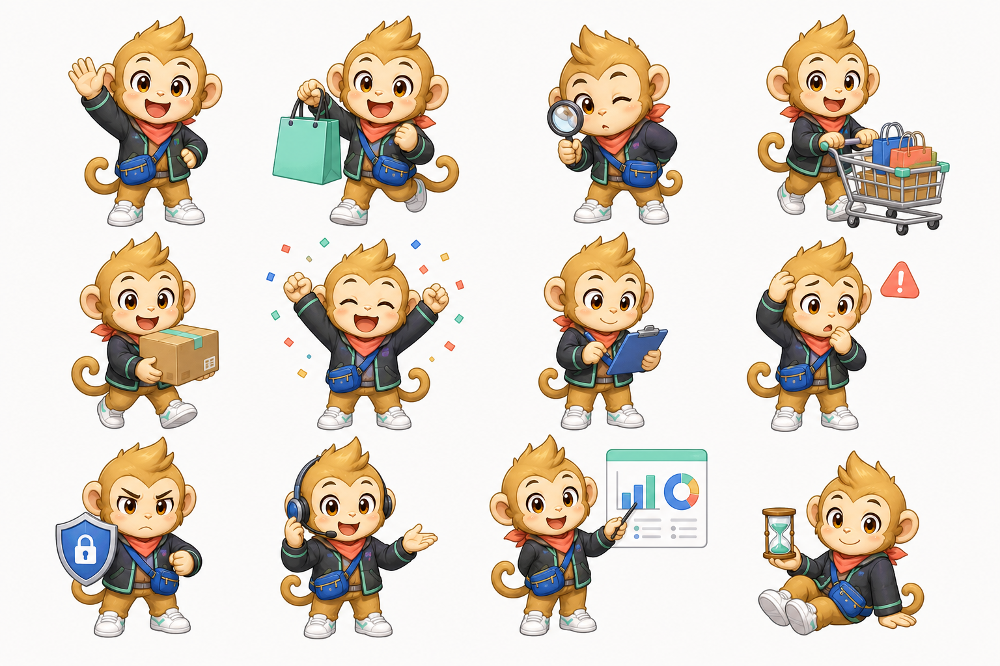

# MonkeyShop 精密型卡哇伊商业系统设计规格

日期：2026-07-13

状态：已自审，待用户书面复核

方案：B - 精密型商业系统结构 + 成熟卡哇伊二次元视觉 + 猴子拟人吉祥物

本规格取代 `2026-07-12-monkeyshop-ui-experience-design.md` 中与视觉方向、页面架构、接口接入范围和验收标准冲突的内容。旧规格和实施计划只能作为历史参考，不能继续作为完成依据。

## 1. 决策摘要

用户已确认以下决策：

1. 允许重构所有可重构的 UI，包括导航、路由分组、字段分组、页面信息架构和操作流程。
2. 消费者端与管理端尽可能使用现有后端功能，但机器回调、Webhook、内部探针等接口不为了覆盖率而暴露成页面。
3. 主结构采用高信息密度、强搜索、表格优先的精密型商业系统。
4. 视觉采用成熟的卡哇伊二次元风格，不幼儿化，不牺牲后台操作效率。
5. 品牌角色采用原创猴子拟人吉祥物，并提供多动作、多情绪的完整状态资产。

## 2. 当前审查基线

### 2.1 UI 基线

- 前端包含 20 个视图和消费者、认证、管理三类路由。
- 页面文件普遍过大，多数业务状态、表单和视图布局集中在单文件中。
- 消费者空态会留下大面积无意义空白；认证页移动端先显示长表单、后显示主视觉。
- 管理端顶部标题和页面标题重复，页面存在两个一级标题。
- 路由异常会移除整个应用壳；懒加载失败只有控制台日志，没有恢复入口。
- 设计 Token 已建立但迁移不完整，页面和共享样式仍存在第二套硬编码节奏。
- 当前浏览器测试以成功态和 Mock API 为主，没有可靠的视觉、暗色、空态、错误态和真实后端回归。

### 2.2 注册与限流基线

- 前端注册和重置密码只校验最少 8 位。
- 后端密码策略要求至少 10 位，同时包含大小写字母、数字、特殊字符且不允许空格。
- 后端 422 详细原因被前端统一隐藏为“注册失败”。
- 注册接口按 IP 每小时仅允许 3 次，且请求在业务校验前消耗配额。
- 登录 API 限流、登录失败计数和硬锁同时存在；用户名、IP、用户名与 IP 组合均可触发拒绝。
- 验证码阈值与锁定阈值相同，用户没有可用的“先验证码、后锁定”缓冲阶段。

### 2.3 接口与业务基线

当前共有 121 个 canonical handler。由于同时保留 `/api/**` 与 `/api/v1/**`，运行时约有 242 个具体映射。

已确认的阻断问题包括：

- 购物车结算只保存结算快照和子单，不创建支付所需的正式订单。
- 优惠券报价不校验用户持券、券状态和订单绑定，结算不原子核销。
- 订单、支付、库存、履约、积分和埋点没有形成可靠成交闭环。
- Catalog 接口没有匹配安全规则，公开读取和后台写入均可能被最终 `denyAll` 拒绝。
- 支付和退款幂等键不绑定请求指纹，相同键可错误复用旧结果。
- 库存释放、优惠券返还在 URL 安全规则和控制器权限之间存在冲突。
- 生产支付与物流只有沙箱实现，租户导出可返回完成但不生成真实文件。
- PII 保留、审计清理和部分多租户任务只处理默认租户。
- TOTP 密钥明文存储，预签名上传绕过完整文件安全链。

本规格要求先修复这些业务和安全阻断，再把对应入口作为“可用功能”接入 UI。

## 3. 产品定位与设计原则

### 3.1 产品定位

MonkeyShop 是一个同时面向消费者、运营人员和平台管理员的综合商业系统：

- 消费者需要快速发现、比较、购买和跟踪商品。
- 运营人员需要高频扫描、筛选、处理异常并推进履约。
- 平台管理员需要管理风控、租户、账单、配置、导出和审计。

### 3.2 设计原则

1. **结构精密**：搜索、筛选、表格、状态和下一动作优先于装饰。
2. **情绪有度**：吉祥物用于关键状态和品牌时刻，不进入每个卡片和每行表格。
3. **信息诚实**：沙箱、模拟、待接入和不可用状态必须明确，不伪装成生产成功。
4. **恢复优先**：错误必须出现在可恢复的位置，并提供明确下一步。
5. **接口有归属**：每个用户可见操作都对应权限、资源归属和业务状态校验。
6. **移动可完成**：消费者核心流程必须在 390px 宽度完整完成；管理端移动版保留应急处理能力。
7. **证据完成**：构建通过不代表完成，必须有真实后端、数据库和浏览器证据。

## 4. 品牌视觉系统

### 4.1 视觉语言

基础布局沿用精密型商业系统：

- 直线型分区、紧凑工具栏、稳定列宽和明确对齐。
- 页面章节使用无框布局和分隔线，不堆叠装饰卡片。
- 重复商品、订单实体、弹层和真正需要边界的工具才使用卡片。
- 圆角限制为 6px 控件和 8px 卡片、抽屉、弹层。
- 不使用渐变、发光球、模糊光斑或大面积单一色调背景。

卡哇伊视觉由以下元素承担：

- 吉祥物和业务状态插画。
- 小面积薄荷、珊瑚、钴蓝和蜂蜜金色块。
- 轻量的状态切换、庆祝和提示动效。
- 友好但克制的中文文案。

### 4.2 语义色板

浅色主题：

| Token | 建议值 | 用途 |
| --- | --- | --- |
| `--color-canvas` | `#F6F7F9` | 页面底色 |
| `--color-surface` | `#FFFFFF` | 控件、表格和实体表面 |
| `--color-ink` | `#182230` | 主文字 |
| `--color-muted` | `#667085` | 次级文字 |
| `--color-line` | `#D8E0E8` | 分隔线和边框 |
| `--color-primary` | `#0B6E61` | 主要动作和选中 |
| `--color-mint-soft` | `#DDF6F0` | 轻量品牌表面 |
| `--color-cobalt` | `#2F61D5` | 信息、链接和数据强调 |
| `--color-cobalt-soft` | `#E8EEFF` | 信息表面 |
| `--color-coral` | `#C94355` | 高关注但非破坏性强调 |
| `--color-coral-soft` | `#FCE8EB` | 风险提示表面 |
| `--color-honey` | `#A86100` | 价格、会员和商业提醒 |
| `--color-honey-soft` | `#FFF1D7` | 商业提醒表面 |
| `--color-danger` | `#B42318` | 破坏性动作和错误 |

深色主题使用中性石墨底色，保持薄荷、钴蓝、珊瑚和蜂蜜金的语义关系，不把整站做成深蓝或紫色主题。

所有文字和交互状态必须满足 WCAG AA。浅薄荷色只作为表面，不能直接作为承载白字的按钮底色。

### 4.3 字体与密度

- 中文优先使用本地可控的 Noto Sans SC 或系统无衬线栈。
- 拉丁和数字使用相同视觉高度的无衬线字体。
- 表格、金额、库存和编号使用 tabular numerals。
- 字号不随视口宽度缩放，字距保持 0。
- 间距以 4px 为基线，使用 4/8/12/16/20/24/32/40/48 序列。
- 管理端默认密度高于消费者端，但移动触控目标仍不少于 44px。

## 5. 吉祥物系统

### 5.1 角色定义

角色是原创金棕色猕猴拟人吉祥物，具有稳定的冠状发束、琥珀色大眼睛、圆润面部和紧凑轮廓。

固定服装：

- 石墨色短款店员夹克。
- 薄荷绿滚边。
- 珊瑚色领巾。
- 钴蓝色斜挎工具包。
- 白色运动鞋。

角色保持可爱、专业和有行动力，不采用婴儿化比例、过度腮红或与现有版权角色相似的设计。

### 5.2 已确认动作集

| 动作 | 主要用途 |
| --- | --- |
| 欢迎挥手 | 登录、注册完成、首次进入 |
| 手提购物袋 | 购物袋、收藏和会员权益 |
| 放大镜搜索 | 搜索空态、无匹配结果 |
| 推购物车 | 购物车和结算引导 |
| 搬运包裹 | 物流、发货和签收 |
| 庆祝 | 支付、下单和操作成功 |
| 检查夹板 | 库存、订单和任务队列 |
| 库存警告 | 预警、失败和需要关注 |
| 安全盾牌 | 风控、权限和账号安全 |
| 客服耳机 | 帮助、恢复和服务异常 |
| 指向看板 | 数据、统计和新手引导 |
| 沙漏等待 | 加载、排队和限流倒计时 |

### 5.3 使用规则

- 一个页面最多出现一个主要吉祥物。
- 表格、指标条、工具栏和普通卡片不放装饰角色。
- 吉祥物不得遮挡表单、商品、价格、状态和主要动作。
- 成功动效不超过 900ms；加载使用低频轻动作；遵守 `prefers-reduced-motion`。
- 生产资源拆分为独立 PNG/WebP，提供稳定宽高和 1x/2x 版本。
- 透明边缘必须通过浅色和深色背景像素检查；如毛发 alpha 不合格，使用经过设计的语义背景版本，禁止保留明显色边。

## 6. 应用壳与导航

### 6.1 路由区域

路由元数据继续使用三个区域：

- `auth`：登录、注册、重置密码。
- `consumer`：浏览、交易、履约、会员和账户。
- `admin`：运营、供应链、治理和平台管理。

`AppShell` 只由根路由布局创建。页面不再拥有顶栏、侧栏或底部导航。

### 6.2 消费者壳

桌面导航：

- 品牌入口。
- 发现。
- 分类。
- 搜索。
- 推荐。
- 订单。
- 购物袋。
- 会员。
- 账户、主题和语言。

移动端：

- 顶部保留品牌、搜索和购物袋。
- 底部导航固定为发现、搜索、购物袋、订单、我的。
- 结算和支付页面隐藏普通底部导航，避免与主动作竞争。

### 6.3 管理壳

桌面使用固定左侧导航、顶部命令栏和全宽工作区。

导航分组：

1. 运营中心：总览、订单履约、退货售后、支付与退款。
2. 商品供应：商品目录、分类、库存、预占、物流。
3. 增长营销：优惠券、价格试算、秒杀、拼团、会员。
4. 风险数据：风控复核、经营数据、漏斗、画像、审计。
5. 平台治理：租户、账单、配置、导出、文件安全。

顶部命令栏包含全局搜索或命令入口、当前租户、通知、账户、主题和语言。页面标题只在内容区出现一个 `h1`。

移动管理端使用符合 dialog/drawer 规范的导航抽屉，必须支持背景 inert、滚动锁、焦点循环和焦点返回。

## 7. 页面与接口映射

### 7.1 认证与账户

| 页面 | 接口模块 | 功能 |
| --- | --- | --- |
| 登录 | Auth | 登录、MFA、验证码、刷新会话 |
| 注册 | Auth、Upload | 密码策略、验证码、头像、注册 |
| 重置密码 | Auth | 身份确认、验证码、重置 |
| 个人中心 | User、Address、Privacy | 资料、头像、地址、安全、忘记我 |

新增密码策略元数据契约，前端不得再复制后端规则。建议提供 `/api/v1/auth/password-policy`，返回最小长度和复杂度要求。

### 7.2 消费者商城

| 页面 | 接口模块 | 功能 |
| --- | --- | --- |
| 发现与分类 | Catalog、Monkey | 分类树、SPU、商品列表 |
| 搜索与推荐 | Search、Tracking | 搜索、建议、热词、推荐、转化 |
| 商品详情 | Catalog、Inventory、Marketing | 价格、库存、优惠试算、收藏 |
| 购物袋 | Cart、Marketing | 条目、选择、数量、结算预览 |
| 结算与支付 | Cart、Order、Payment、Address | 正式订单、支付、地址、幂等 |
| 订单与售后 | Order、Payment | 订单、退货、退款、评价 |
| 物流 | Logistics、Order | 运费、运单、轨迹、签收 |
| 会员 | Membership | 身份、签到、积分、收藏、降价提醒 |

### 7.3 管理工作台

| 工作区 | 接口模块 | 功能 |
| --- | --- | --- |
| 运营总览 | Stats、Tracking | GMV、订单、访问、漏斗、画像、审计 |
| 商品目录 | Catalog、Monkey、Upload | SPU、SKU、分类、图片和状态 |
| 库存 | Inventory | 仓库库存、预占、释放、扣减、补偿、对账 |
| 订单履约 | Order、Logistics | 发货、运单、签收、退货全流程 |
| 支付退款 | Payment | 支付查询、退款、对账和挂起状态 |
| 营销 | Marketing | 券、价格试算、秒杀和拼团 |
| 会员运营 | Membership | 等级、积分调整和降价任务 |
| 风控 | Risk | 风险评估、复核、处置和信号解释 |
| 租户平台 | Tenant | 租户、续费、降级、配置、账单、导出 |

以下接口不创建普通页面入口：

- 支付回调。
- 物流 Webhook。
- 内部探针和蜜罐路径。
- 仅供服务间编排的扣减、补偿动作。
- 未实现真实供应商能力的沙箱动作。

这些接口通过后台状态、审计和监控呈现结果，而不是允许用户直接伪造回调。

## 8. 注册、登录与限流设计

### 8.1 注册流程

注册采用同页三阶段状态，而不是同时堆叠全部字段：

1. 账户资料：用户名、密码和实时密码规则。
2. 联系与验证：手机号、可选邮箱、头像和验证码。
3. 完成：注册结果、登录入口和消费者首页入口。

字段校验错误显示在字段旁。业务冲突显示在对应字段或表单顶部的内联 Alert。成功后不使用全局 Toast 遮挡下一步。

### 8.2 密码契约

- 前端从后端读取密码策略元数据。
- 默认要求至少 10 位、大小写、数字、特殊字符和无空格。
- 输入时显示逐条规则，满足后即时更新。
- 422 返回机器可读字段错误，前端不得只显示“注册失败”。
- 密码泄露检查不可用时按环境策略处理，不以不透明错误永久阻断所有用户。

### 8.3 渐进式限流

限流从硬编码枚举迁移到可配置属性，并区分边缘保护、身份维度和业务成功：

注册建议：

- 开发环境：IP 每小时 120 次，便于本地验收。
- 生产边缘保护：IP 每 15 分钟 20 次。
- 生产身份保护：用户名哈希和手机号哈希每小时各 5 次。
- 前端校验失败不发送请求，不消耗服务端注册配额。
- 服务端在可解析请求后再消耗身份维度配额。

登录建议：

- IP 每 5 分钟 30 次，用户名与 IP 组合每 5 分钟 10 次。
- 同一组合连续失败 3 次后要求验证码。
- 同一组合连续失败 10 次后锁定 10 分钟。
- 不使用单一用户名或共享 IP 的低阈值硬锁，避免账号和 NAT DoS。
- 成功登录清除用户名与 IP 组合失败状态，并衰减共享 IP 计数。

429 必须携带准确 `Retry-After`。UI 使用沙漏吉祥物和内联倒计时，倒计时期间禁用提交，但允许修改字段和离开页面。

## 9. 交易闭环与上线前置修复

### 9.1 结算与订单

- 结算预览只读，不产生不可恢复副作用。
- 正式结算在一个应用事务中创建订单、子单、明细、优惠分摊和库存预占。
- 平台券只应用一次，并按明确规则在子单之间分摊。
- 清空购物车发生在正式订单成功后。
- 新订单状态为待支付，不得直接进入已支付。

### 9.2 优惠券

- 报价按 `userId + couponCode` 查询用户券。
- 校验券状态、有效期、适用范围、门槛和订单绑定。
- 订单落库时原子核销。
- 订单失败或取消按幂等补偿返回。

### 9.3 支付与退款

- 同一订单不得创建多个并行有效支付意图。
- 幂等键必须保存规范化请求指纹；键相同但请求不同返回 409。
- 支付成功驱动订单状态、库存扣减、履约准备、会员积分和可信埋点。
- 退款必须从合法退货或管理员审批流程进入。
- 网关失败、超时和不确定状态不能被记为成功。
- 生产 Profile 禁止加载沙箱支付与物流实现。

### 9.4 履约、风控与数据

- 创建运单只允许履约或卖家权限，并校验订单状态。
- 物流签收同步订单履约状态。
- 秒杀、拼团、普通下单和支付都经过风险阻断点。
- 订单创建和支付成功由服务端发布不可伪造的业务事件。
- 积分、成长值、漏斗和商品画像由业务事件幂等投影，不依赖用户手工录入。

## 10. 组件系统

### 10.1 基础组件

- `AppShell`：认证、消费者、管理壳切换。
- `PageHeader`：唯一页面标题、说明和主动作。
- `CommandBar`：全局搜索、命令和租户上下文。
- `PageToolbar`：搜索、筛选、排序、刷新和批量动作。
- `DataTableShell`：稳定表格、分页、滚动和空错状态。
- `AsyncStateView`：按表格、网格、详情、表单区分骨架。
- `FormSection`：字段分组、验证、脏数据和提交状态。
- `InlineNotice`：字段、区块和业务阻断反馈。
- `StatusTag`：稳定业务状态映射。
- `ConfirmAction`：高影响动作确认。
- `MascotState`：吉祥物动作、尺寸、替代文本和减少动效策略。

### 10.2 控件规则

- 使用 Lucide 或 Element Plus 已有图标，不手绘重复 SVG。
- 熟悉命令优先使用图标按钮并提供 tooltip 和 aria-label。
- 模式选择使用 segmented control；二元设置使用 switch 或 checkbox。
- 颜色使用真实 swatch；数字使用 stepper、input 或 slider。
- 表单按钮文案稳定，加载状态不得改变按钮几何尺寸。
- 卡片不嵌套卡片，页面章节不伪装成浮动卡片。

## 11. 状态机与反馈

资源状态统一为：

`idle -> loading -> success | empty | error`

已有数据刷新进入 `updating`，保留旧数据。Mutation 使用独立 `pendingKey`，只禁用受影响行或动作。

吉祥物映射：

- 加载：沙漏。
- 空搜索：放大镜。
- 空购物袋：购物袋或购物车。
- 成功：庆祝。
- 警告：库存警告。
- 权限和风控：安全盾牌。
- 服务恢复：客服耳机。

Toast 只用于轻量成功或跨页面完成事件。字段错误、区块错误、限流和权限阻断必须内联显示。原始 `Too many requests`、`Operation is not permitted` 和异常堆栈不得直接显示。

## 12. 响应式与可访问性

验收宽度：320、390、768、1024 和 1440px。

- 页面不得整体横向滚动；表格在自身容器内滚动或降级为行详情。
- 移动触控目标至少 44x44px，桌面图标按钮至少 36x36px。
- 每页只有一个 `h1`。
- `document.title` 和 `<html lang>` 随路由、语言更新。
- 提供跳过导航链接，路由完成后聚焦主内容或页面标题。
- 登录、注册和重置密码具有明确页面标题。
- 移动端保留语言切换能力。
- 管理抽屉使用真实模态语义和背景隔离。
- 图片具有准确 alt；纯装饰吉祥物使用空 alt 或 `aria-hidden`。
- 浅色、深色、键盘和减少动效均通过 WCAG A/AA 检查。

## 13. 性能与稳定性

- 路由按区域懒加载，管理端代码不进入消费者首屏。
- 吉祥物和商品图使用稳定宽高、响应式资源和延迟加载。
- 首屏只加载当前需要的一个吉祥物动作，不加载整张动作表。
- 搜索防抖；请求支持取消和序号保护。
- 页面隐藏时暂停轮询；高频事件使用 latest-state-wins。
- 大表分页，必要时虚拟化；行更新按稳定 ID patch。
- 路由 chunk 加载失败显示恢复界面，并对版本不匹配执行一次受控刷新。
- 错误边界只包裹页面内容，应用壳始终提供返回首页、上一页和退出路径。

## 14. 测试与契约

### 14.1 前端

- Vitest 覆盖密码规则、限流倒计时、异步竞态、通知去重和路由元数据。
- Playwright 覆盖所有页面的桌面、移动、浅色、深色和关键状态。
- 关键交易流程使用真实 Spring Boot，不使用 `page.route()` 替代后端。
- 视觉回归覆盖认证、商城、商品、购物袋、结算、订单、管理总览、库存、营销、风控和租户。

### 14.2 后端

- 使用带完整 SecurityFilterChain 的 MockMvc 权限矩阵覆盖全部 Controller。
- MySQL 8 空库执行全部 Flyway 迁移，并覆盖旧版本升级。
- Redis 参与登录、验证码、限流、幂等和关键缓存测试。
- 交易 E2E 覆盖结算、订单、支付、库存、优惠券、积分和埋点。
- 多租户集成测试至少覆盖租户 1 与租户 2。

### 14.3 API 契约

- 从运行中的 OpenAPI 生成 method/path/schema/status 基线。
- 修复 OpenAPI server 与 path 的双 `/api/v1` 前缀。
- 必需 `Idempotency-Key` 在控制器和 OpenAPI 中声明为 required。
- 分页接口只返回一种稳定结构，设置默认和最大 size。
- malformed JSON 和类型解析返回 400，语义校验返回 422。
- 前端 API 模块与 OpenAPI 自动对照，删除只扫描少量文件的假契约脚本。

## 15. 实施阶段

1. **质量基线**：恢复可信 lint、unit、contract、MockMvc、MySQL/Redis 和 Playwright 门槛。
2. **认证与安全**：修复注册、密码策略、验证码、限流、Catalog 安全规则和错误契约。
3. **设计基础**：Token、吉祥物资源、组件、三类应用壳、状态和反馈。
4. **交易闭环**：购物袋、正式订单、优惠券、支付、库存、退款和履约。
5. **消费者页面**：发现、分类、搜索、推荐、商品、订单、物流、会员和账户。
6. **管理工作台**：运营、商品、库存、订单、支付、营销、风控、数据和租户。
7. **平台完整性**：真实支付/物流适配、导出、PII、多租户、文件安全和运维配置。
8. **全量验收**：真实 E2E、全路由视觉矩阵、Axe、性能、控制台和最终 CR。

每一阶段先写失败测试，再实现，再运行本阶段与相关回归。不得把全部问题留到最后一次集中修复。

## 16. 完成定义

只有以下条件全部满足，才可声明完成：

- 20 个现有页面和新增业务工作区全部迁移到新设计系统。
- 吉祥物动作按状态拆分并实际接入，不使用整张动作表作为生产 UI。
- 注册密码规则与后端一致，422 可理解，429 有倒计时且不会因两次普通失败锁死。
- 购物袋到订单、支付、库存、券、积分、物流和埋点形成真实闭环。
- 适合用户操作的后端模块均有清晰 UI 入口；机器接口不被错误暴露。
- 所有 P0 和 P1 业务、安全、租户、文件与部署阻断已修复或明确由真实外部能力阻塞。
- 全部接口权限、资源归属、幂等和分页契约有自动化覆盖。
- 前端 lint、typecheck、unit、build、contract、Axe 和视觉回归全部通过。
- 后端单元、完整上下文、MySQL/Redis 集成和真实交易 E2E 全部通过。
- 目标视口无重叠、破图、页面级横向滚动、原始后端错误、不可恢复 loading 或重复页面标题。

## 17. 明确非目标

- 不在本阶段替换 Vue、Pinia、Vue Router 或 Element Plus。
- 不为了接口覆盖率创建危险的回调、Webhook 或内部探针操作页。
- 不伪造第三方支付、物流、短信、邮件和数据导出成功。
- 不把吉祥物放进每个指标、卡片或表格行。
- 不以单一构建成功、Mock E2E 或源码字符串测试作为完成证据。
